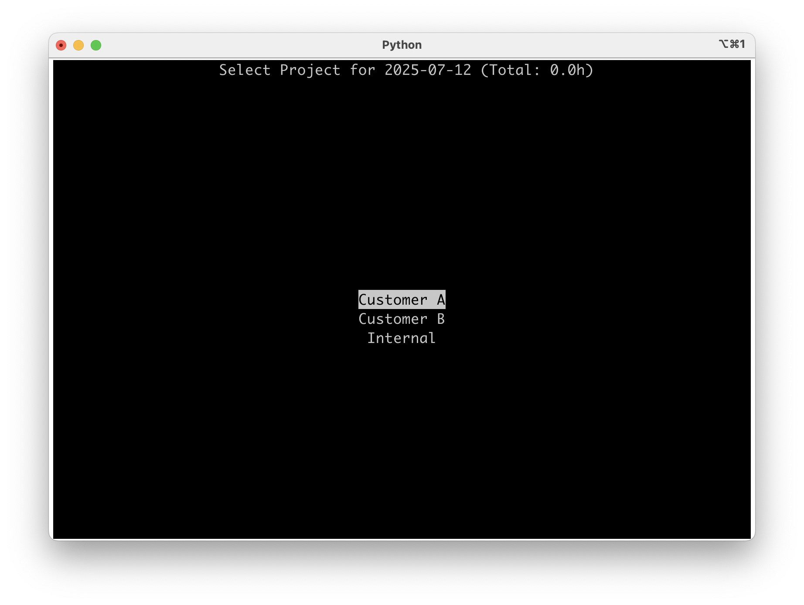

# Moco time booking script

Easily book times in moco via a Terminal UI script.
Especially helpful for repeatedly occurring stuff.

## Usage

1. Install [uv](https://docs.astral.sh/uv/) (very nice python wrapper).
2. Fill both `moco.yaml` and `secret.yaml` with some _activities_ that you often do.
3. Fill the _project_ list manually, since most of the users won't have permissions to read those via API. This will help you navigate later.
4. Run the script! `uv run --script moco.py`
5. Use the arrow keys no navigate, return to select or "/" to filter the displayed list.
6. Press 'q' to quit.

## Screenshots of the flow

1. Select if you want to book the fast 5 days or the next 7 days

    

2. Select a date

    

3. Select a project

    

4. Select a task

    

5. Select the time you've spend

    

6. Select an activity

    

7. Repeat!

    

## How to get the project and task IDs?

Since most of the time you do not have full access, here is a trick: Create a manual entry in moco and perform this curl request:

```sh
curl --silent --request GET \
  --url 'https://mycompany.mocoapp.com/api/v1/activities?from=2025-02-28&to=2025-02-28' \
  --header 'authorization: Token token={{token}}'
```

If you are lazy and have `jq` installed, use this to get the project ID and task ID:

```sh
curl --silent --request GET \
  --url 'https://mycompany.mocoapp.com/api/v1/activities?from=2025-03-03&to=2025-03-03' \
  --header "authorization: Token token=${token}" | jq -r '.[] | "\(.project.id) \(.project.name) \(.task.id) \(.task.name)"'
```
